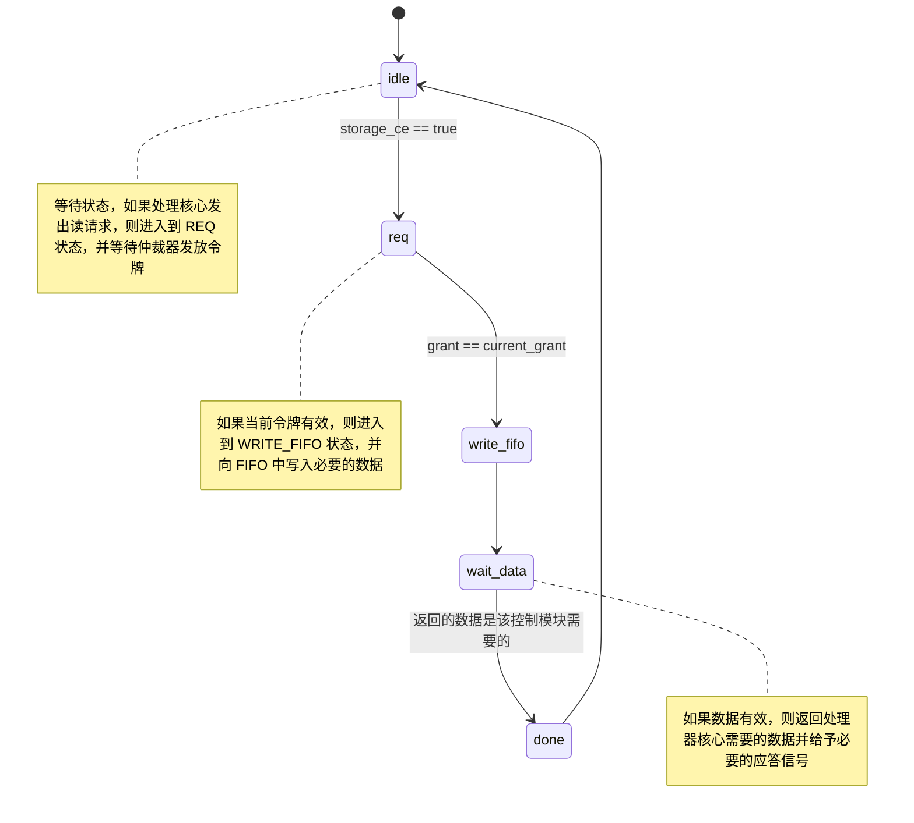
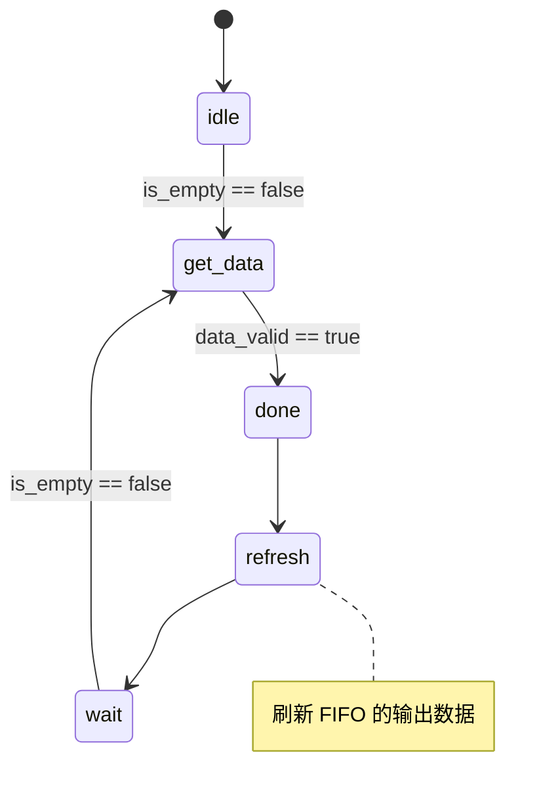
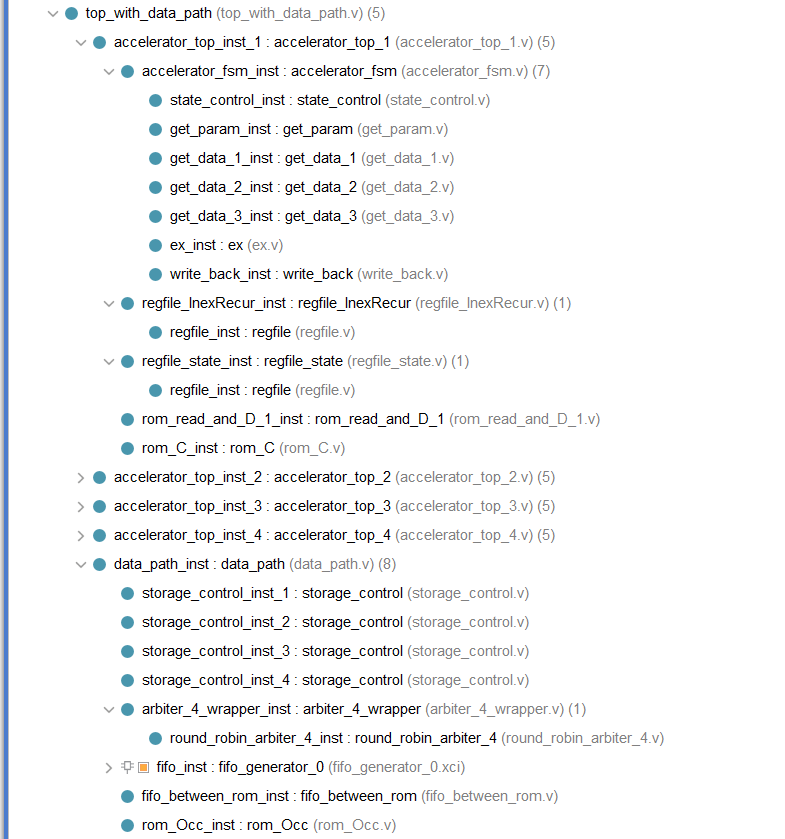
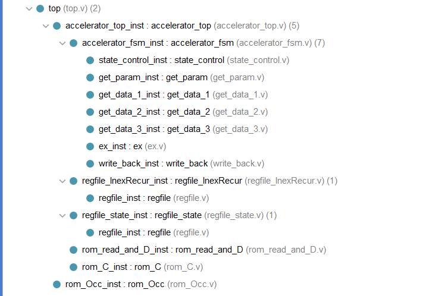

# my_accelerator

本科毕设的项目

**基于 BWT 的短序列比对算法的硬件加速器**

- *参考文献*：[Hardware-Acceleration of Short-Read Alignment Based on the Burrows-Wheeler Transform](./reference/Hardware-Acceleration%20of%20Short-Read%20Alignment.pdf)

- *核心算法*：参考文献中提及 `Algorithm 1. Short-read Alignment Algorithm` 

- *加速核心*：`Algorithm 1. Short-read Alignment Algorithm` 中的 `InexRecur()` 

值得一提的是：

- `InexRecur()` 函数的递归调用完成了整个比对过程。
  
- 该过程的输出结果是后缀数组/序列的索引（SA_index），仍需要需要借助其他工具生成 CIGAR 串等其他的比对信息。

- 根据调用 `InexRecur()` 函数调用过程中的参数可确定最终的结果，因`i<0`导致的递归中止对应的`k`和`l`为匹配结果。因此，记录该函数调用过程中的参数是必要的。

---

## 前提说明

**完整的加速器系统包含了两个部分：数个加速器核心和数据通路**

- 加速器核心的整体结构为**状态机**，每个状态的设计参考了**CPU的经典五级流水线**

- 数据通路的整体结构为**仲裁器+FIFO**，FIFO 和存储器之间还有一个中间模块，实现最终的读取(*可以根据实际需要修改该中间模块以适配不同的存储器*)

设计语言：verilog HDL（2005年标准）

相关工具：vivado 2020.1

板载验证：pynq-z2（镜像v2.6）

---

## 想法构思

`InexRecur()` 本质上是递归调用，需要手动维护调用现场并保存当前的结果。
  
  比对过程需要的数据：
  
  - 1. 与参考序列相关：C，Occ（出现数组）
  
  - 2. 与短序列相关：W（短序列本身），D（搜索边界）

  - 3. 与执行过程有关：调用 `InexRecur()` 的参数，当前参数执行的状态

  其中，将1、2两项称为 **rom** （执行过程中只读不写）；3称为 **regfile**（执行过程中有又读又写）。


  从数据量的角度来说，*C 、W 、D都是较小的数据量*，不需要大规模存储，利用 FPGA 的片上资源就可以实现存储。*Occ 是巨大的数据量（与参考序列有很大的关联）*，存储在 FPGA 上是不现实的，需要使用板载 DDR 存储器。

  加速器核心的任务在于取数据、判断当前执行位置、发起新的调用、执行比对算法。

  数据通路的任务在于处理多个加速器核心同时访问 Occ 数据时出现的冲突。

  🐖注: 数据 C 、W 、D 通过片上资源实现存储，即每个处理器核心都有自己的数据，是私有数据；而数据 Occ 存储在 DDR，是共有数据。

  🐖注：读取 Occ 的过程中必涉及等待，故读取 Occ 数据采用应答机制。

### 加速器核心

  #### 状态机
  
  ```mermaid
    stateDiagram
        [*] --> idle 
        idle --> get_param : is_start == true
        get_param --> get_data_1 : is_find == true
        get_data_1 --> ex : is_get_data_in_Occ == false
        get_data_1 --> get_data_2 : is_get_data_in_Occ == true
        get_data_2 --> get_data_3
        get_data_3 --> ex
        ex --> write_back
        write_back --> get_param
        ex --> finish : is_finish == true
        finish --> [*]

        state get_param {
          now --> go_back
          go_back --> now
        }

        note right of idle
            复位初始状态
        end note

        note right of get_param
            包含一个小的状态机，找到尚未完成的参数调用
        end note

        note right of get_data_2
            保持该状态直至数据有效
        end note

        note right of get_data_3
            保持该状态直至数据有效
        end note
  ```

  #### 现场保护

  `regfile_state` 和 `regfile_InexRecur` 中的数据一一对应（地址相同）

  `regfile_InexRecur`: 记录每次调用 `InexRecur()` 的参数

  `regfile_state`：记录对应参数的执行位置、回溯地址、当前是否执行结束

  各个执行位置如下所示：

  ```
  InexRecur(W, i, z, k, l)
  begin              =================> NONE
  |  if z<D (i) then
  |  |  return φ
  |  end             =================> STOP_1
  |  if i < 0 then
  |  |  return [k,l]
  |  end             =================> STOP_2
  |  I = φ          
  |  I = I ∪ InexRecur(W, i − 1, z − 1, k,l)
  |                  =================> INSERTION_{A,C,G,T}
  |  for each b ∈ {A, C, G, T} do
  |  |  kb = C (b) + O (b, k − 1) + 1
  |  |  lb = C (b) + O (b, l)
  |  |  if kb ≤ lb then
  |  |  |  I = I ∪ InexRecur(W, i, z − 1, kb, lb)
  |  |  |           =================> DELETION_{A,C,G,T}
  |  |  |  if b = W[i] then
  |  |  |  |  I = I ∪ InexRecur(W, i − 1, z, kb, lb)
  |  |  |  |        =================> MATCH_{A,C,G,T}
  |  |  |  else
  |  |  |  |  I = I ∪  InexRecur(W, i − 1, z − 1, kb, lb)
  |  |  |  |        =================> SNP_{A,C,G,T}
  |  |  |  end
  |  |  end
  |  end
  |  return I
  end
  ```
  
### 数据通路

数据通路可大致分为两部分：

- FIFO前：仲裁器、读取控制模块`storage_control`(*每个处理器核心对应一个读取控制模块*)
- FIFO后：FIFO和存储器之间的中间模块`fifo_between_rom`(*可以根据实际需要修改该中间模块以适配不同的存储器*)
  
#### 仲裁器

四通道轮询仲裁器

根据当前的请求`req`，给予不同的`storage_control`令牌，使得`storage_control`获取当前对FIFO的写权限，将所需要的数据的地址以及`storage_control`的唯一编号写入到FIFO。

#### 存储控制模块

状态机



#### FIFO

vivado中自带的FIFO_ip

#### 中间模块

读取 FIFO 中的数据并根据地址从存储中读取有效数据返回给存储控制模块

状态机



---
  
## 文件结构

`./sim_1` 中为测试文件；`./sources_1` 中为源代码。

🐖注：`./sim_1` 中很多测试文件是在开发过程中写的，其调用的模块名称、接口定义与最终有差异。

`./sim_1` 中的测试文件彼此没有依赖关系，不再其介绍文件结构。

`./sources_1` 中的文件结构

```
.
├── _data                       // 相关数据
|   |                            
|   ├── _public
|   |   |
|   |   └── Occ.data          
|   |
|   └── _private
|       | 
|       ├── C.data
|       ├── read_and_D_1.data
|       ├── read_and_D_2.data
|       ├── read_and_D_3.data
|       └── read_and_D_4.data
|
├── _accelerator                // 加速器核心顶层
|   |                           
|   ├── accelerator_top.v       
|   ├── accelerator_top_1.v     // 每个加速器处理不同的短序列，使用不同 rom_read_and_D
|   ├── accelerator_top_2.v
|   ├── accelerator_top_3.v
|   └── accelerator_top_4.v
|
├── _rom_read_and_D             // 短序列存储rom
|   |                            
|   ├── rom_read_and_D_1.v
|   ├── rom_read_and_D_2.v
|   ├── rom_read_and_D_3.v
|   └── rom_read_and_D_4.v   
|
├── _accelerator_fsm            // 加速器核心状态机
|   |  
|   ├── accelerator_fsm.v       // 加速器核心状态机顶层
|   ├── state_control.v   
|   |      
|   ├── _component              // 加速器状态模块
|   |   |
|   |   ├── get_param.v         // 取参数
|   |   ├── get_data_1.v        // 取数据(rom_read_and_D、rom_C)
|   |   ├── get_data_2.v        // 取数据(rom_Occ)
|   |   ├── get_data_3.v        // 取数据(rom_Occ)
|   |   ├── exa.v               // 判断/执行
|   |   └── write_back.v        // 回写
|   |
|   └── _regfile                // 寄存器
|       |
|       ├── regfile_InexRecur.v
|       ├── regfile_state.v
|       └── regfile.v
|
├── _data_path                   // 数据通路
|   |
|   ├── data_path.v
|   |
|   └── _component
|       |
|       ├── storage_control.v
|       ├── fifo_between_rom.v
|       ├── fifo_between_rom.v
|       ├── arbiter_4_wrapper.v
|       |
|       └── _arbiter
|           |
|           └── round_robin_arbiter_4.v
|
├── rom_Occ.v
├── rom_C.v  
├── rom_read_and_D.v
|
├── top.v                       // 单个处理器核心设计的顶层
└── top_with_data_path.v        // 4个处理器核心、带有数据通路设计的顶层
```
---
## 项目结构

带有数据通路、四核加速器结构



单核加速器结构



---

## 备注（2020/6/20）

🐖注：rom 中的数据在初始化的时候被加载进去。理想情况中 rom_Occ 会被 ddr 代替


有关 python 和 C/C++ 语言执行效率的差别，参考 `./reference` 中的总结。

PL 部分使用 DDR 读取数据（仿真成功，板载验证失败）

多核心处理（四核心并行处理）
